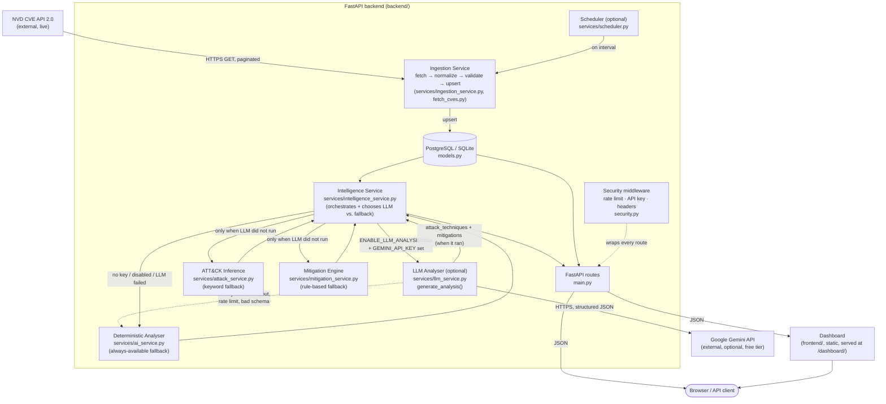

# System Architecture

The end-to-end data pipeline, from external source to user interface.

**Design principle carried through every layer:** NVD is the sole authoritative source of vulnerability facts. Everything generated inside the Backend box (LLM Analyser, Deterministic Analyser, ATT&CK Inference, Mitigation Engine) is advisory, evidence-labelled, and never overwrites or contradicts what NVD reported — see `IntelligenceResponseSchema.disclaimer` in [../backend/schemas.py](../backend/schemas.py).

**Two analysers, one contract:** `intelligence_service.py` always calls `llm_service.generate_analysis()`, which itself decides whether to call Gemini or go straight to the deterministic analyser (see [llm-decision-flow.md](llm-decision-flow.md)). Either way it returns the same `AnalysisResult` shape, so the rest of the pipeline — persistence, schema validation, the API response — never needs to know which one ran. This project is free by default (no LLM call, no external cost); Gemini is an opt-in upgrade gated by two independent settings, never silently enabled by one stray env var.
