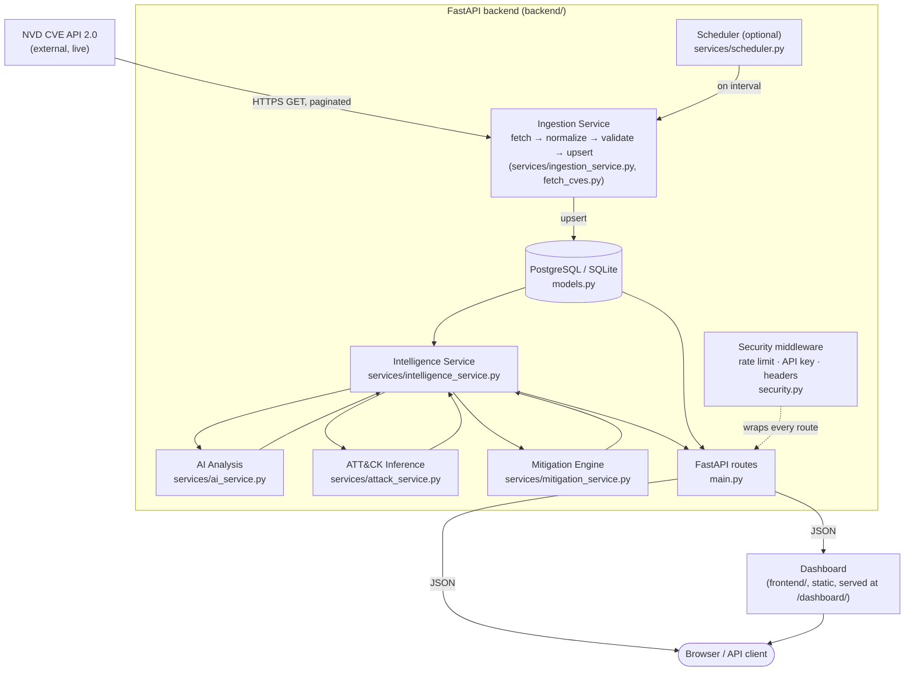

# System Architecture

The end-to-end data pipeline, from external source to user interface.

**Design principle carried through every layer:** NVD is the sole authoritative source of vulnerability facts. Everything generated inside the Backend box (AI Analysis, ATT&CK Inference, Mitigation Engine) is advisory, evidence-labelled, and never overwrites or contradicts what NVD reported — see `IntelligenceResponseSchema.disclaimer` in [../backend/schemas.py](../backend/schemas.py).
