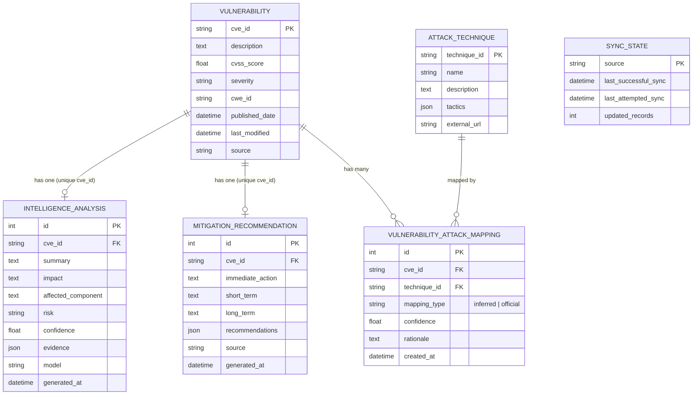

# Database Schema (Entity-Relationship Diagram)

Generated from the live SQLAlchemy models ([../backend/models.py](../backend/models.py)); matches [../database/schema.sql](../database/schema.sql).

**Notes:**
- `INTELLIGENCE_ANALYSIS.cve_id` and `MITIGATION_RECOMMENDATION.cve_id` are each `UNIQUE` — a true one-to-one relationship enforced at the database level, not just assumed by the ORM (see [docs/Day21.md](../docs/Day21.md)).
- `VULNERABILITY_ATTACK_MAPPING` has a composite `UNIQUE(cve_id, technique_id)` constraint, preventing the same technique from being mapped twice to one CVE.
- All three child tables cascade-delete (`ondelete="CASCADE"`) when their parent `Vulnerability` row is removed — no orphaned advisory records can exist.
- `SYNC_STATE` has no foreign key to `Vulnerability` — it tracks ingestion progress per source (`"NVD"`), independent of any specific CVE.
