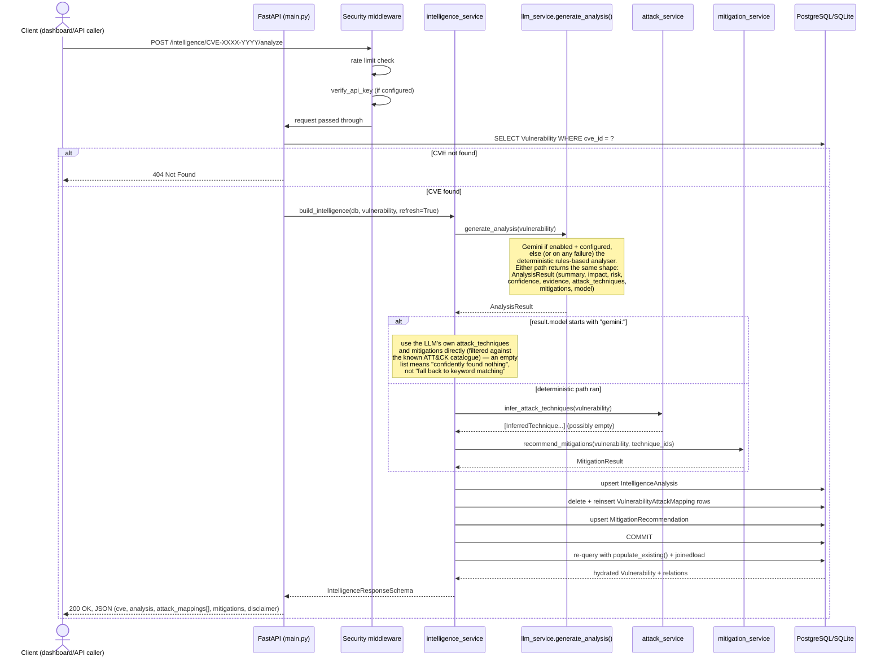

# Sequence: `POST /intelligence/{cve_id}/analyze`

The request flow for the project's core feature — generating (or regenerating) a full, evidence-labelled intelligence record for one CVE. This is the current flow, including the optional LLM path (`services/llm_service.py`) — see [llm-decision-flow.md](llm-decision-flow.md) for what happens inside `generate_analysis()` itself.

**Why `populate_existing()` matters here** (see [docs/Day21.md](../docs/Day21.md)): the existence check inside `build_intelligence()` reads `vulnerability.analysis` *before* the generate step runs, which can cache a stale `None` on the SQLAlchemy session's identity-mapped object. Without forcing the final query to refresh already-loaded relationship attributes, the response could incorrectly reflect pre-generation state even though the commit above it succeeded.
